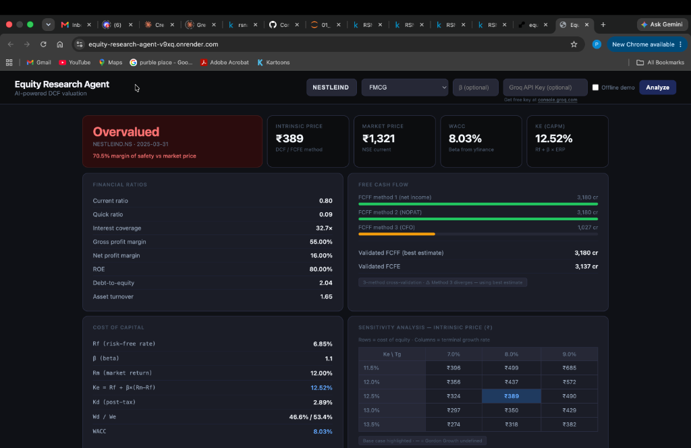
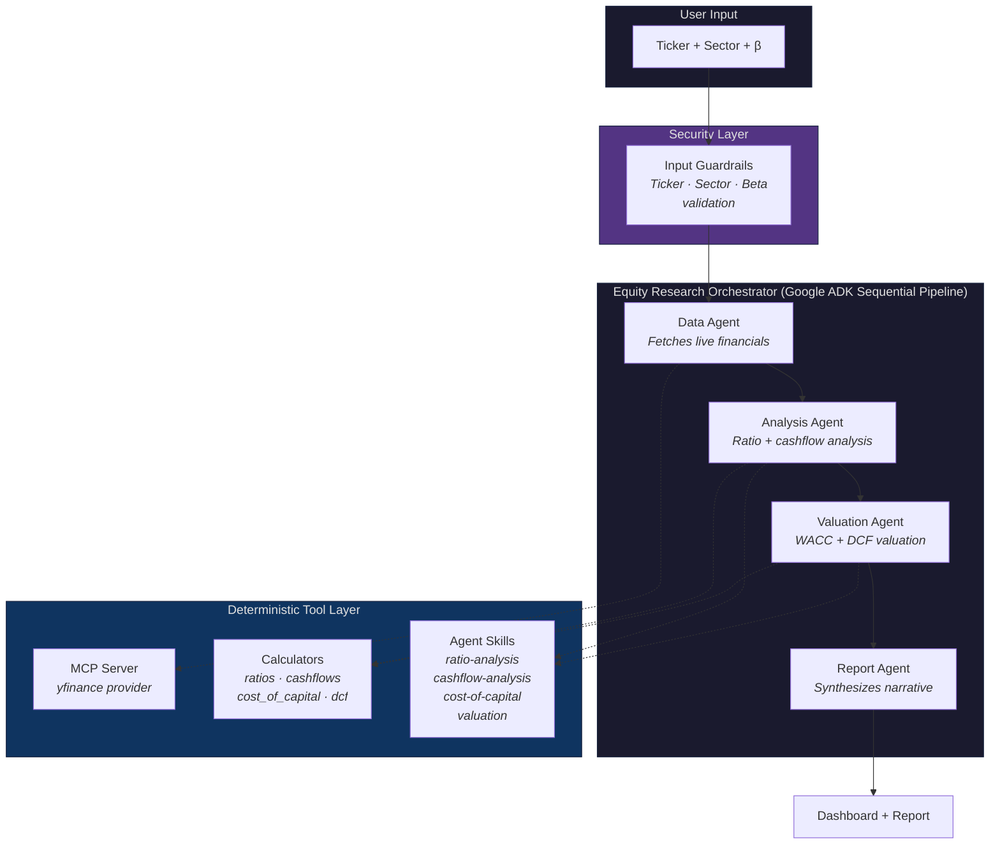

<div align="center">

#  AI Equity Research Analyst

**Autonomous multi-agent system that produces institutional-grade equity research reports — from live financials to DCF valuation verdict in minutes.**

[](https://www.python.org/downloads/)
[](#verified-against-academic-ground-truth)
[](LICENSE)
[](https://equity-research-agent-v9xq.onrender.com/)

<br/>



<sub>Live dashboard showing Nestle India (NESTLEIND) analysis: DCF intrinsic price ₹389 vs market price ₹1,321, with 3-method FCFF cross-validation, CAPM/WACC computation, and sensitivity analysis grid.</sub>

</div>

---

## Motivation

During my Finance minor, I completed a full equity research project on Cipla Ltd. — manually computing ratios, FCFF/FCFE across three cross-validating methods, CAPM/WACC, DCF valuation, sensitivity analysis, and a final undervalued/overvalued verdict. It took days of careful Excel work.

This project automates that exact workflow using a multi-agent AI system. The goal: make institutional-quality equity research accessible in minutes, not days — while keeping every calculation **deterministic, auditable, and verified**.

---

## What It Does

Enter a stock ticker and sector → get a complete equity research report:

- **Financial ratio analysis** — liquidity, solvency, profitability, efficiency, DuPont decomposition
- **Free cash flow analysis** — FCFF and FCFE each computed via **3 independent cross-validating methods**
- **Cost of capital** — CAPM-derived cost of equity, post-tax cost of debt, WACC
- **DCF valuation** — 3-year forecast with Gordon Growth terminal value → intrinsic share price
- **Sensitivity analysis** — 2D grid of intrinsic price across Ke × terminal growth rate scenarios
- **Investment verdict** — Undervalued / Fairly Valued / Overvalued vs live NSE market price

---

## Architecture



**4 specialized agents** in a sequential pipeline, each with a single responsibility:

| Agent | Role | Tools |
|---|---|---|
| `data_agent` | Fetch live financial data from Yahoo Finance | MCP Server (yfinance provider) |
| `analysis_agent` | Run ratio analysis + 3-method cashflow cross-validation | Agent Skills + Python Calculators |
| `valuation_agent` | Compute CAPM/WACC + DCF intrinsic valuation | Agent Skills + Python Calculators |
| `report_agent` | Synthesize results into investment narrative | LLM narrative only (no calculations) |

---

## Key Design Principle: No LLM Math

> *"All numerical calculations are performed by deterministic Python calculators — not by the LLM."*

Every financial calculation delegates to verified Python functions in `app/calculators/`. The LLM orchestrates, narrates, and synthesizes — but **never computes** a ratio, a WACC, or an intrinsic price itself.

**Why?** LLMs produce plausible-sounding but unverifiable numbers. Financial models demand auditability. Every number in the report is traceable to a specific Python function call with known inputs.

---

## Why This Architecture

This isn't a "GPT wrapper" — it's a deliberately engineered system with design decisions that reflect production ML thinking:

| Decision | Why |
|---|---|
| **Deterministic calculators** separate from LLM | LLM floating-point reasoning is non-deterministic and unauditable. Financial reports require reproducible numbers. |
| **3-method cross-validation** for FCFF and FCFE | If methods disagree beyond tolerance, the system raises an error rather than silently picking one — catching data quality issues automatically. |
| **MCP server for data access** | Swappable data provider architecture (`base.py` → `yfinance_provider.py`). Can replace Yahoo Finance with Bloomberg/Refinitiv without touching agent logic. |
| **Agent Skills as subprocess isolation** | Each skill runs in its own subprocess with a `SKILL.md` contract. Skills are reusable, testable, and decoupled from the agent that invokes them. |
| **Input guardrails before LLM** | Ticker, sector, and beta are validated via `guardrails.py` before any LLM sees them. Prevents prompt injection and invalid inputs at the boundary. |
| **Smart rate limiting** | Custom token bucket pacer intercepts LLM calls to stay under Groq TPM limits — no 429 errors mid-analysis. |

---

## Verified Against Academic Ground Truth

The calculation engine was built and tested against a **professor-graded (full marks) equity research project** for Cipla Ltd. FY2025.

**107 unit tests** verify calculators reproduce known-correct outputs:

| Calculator | Tests | Verified Against |
|---|---|---|
| `ratios.py` | Liquidity, profitability, solvency, efficiency, DuPont | Cipla FY2025 Excel |
| `cashflows.py` | FCFF (3 methods) + FCFE (3 methods) cross-validation | Cipla FY2025 Excel |
| `cost_of_capital.py` | CAPM, cost of debt, WACC, capital weights | Cipla FY2025 Excel |
| `dcf.py` | DCF forecast, terminal value, intrinsic price, sensitivity | Cipla FY2025 Excel |
| `guardrails.py` | Ticker/sector/beta validation + injection defense | Security test suite |

Key verified outputs for Cipla FY2025:

| Metric | Value |
|---|---|
| WACC | 8.40% |
| Cost of Equity (Ke) | 8.44% |
| Intrinsic Share Price | ₹4,934.01 |
| Verdict | **Undervalued** vs ₹1,441 market price |

---

## Tech Stack

| Layer | Technology |
|---|---|
| Agent Framework | [Google ADK](https://google.github.io/adk-docs/) (Agent Development Kit) |
| LLM | `openai/gpt-oss-20b` via [Groq](https://groq.com) + [LiteLLM](https://github.com/BerriAI/litellm) |
| Data Source | [yfinance](https://github.com/ranaroussi/yfinance) via custom MCP server |
| Finance Engine | Pure Python calculators (no external finance libraries — all formulas from scratch) |
| Backend | FastAPI + uvicorn |
| Frontend | Single-file dark theme dashboard (vanilla HTML/CSS/JS) |
| Testing | pytest (107 unit tests) |
| Deployment | Docker + [Render](https://render.com) |

---

## Project Structure

```
equity-research-agent/
├── specs/
│   └── equity_research_agent.md     # Spec written before any code (spec-first)
├── app/
│   ├── calculators/                 # Deterministic financial math
│   │   ├── ratios.py                # Liquidity, profitability, solvency, efficiency
│   │   ├── cashflows.py             # FCFF/FCFE (3-method cross-validation each)
│   │   ├── cost_of_capital.py       # CAPM, WACC, capital structure weights
│   │   └── dcf.py                   # DCF forecast, terminal value, sensitivity grid
│   ├── mcp/                         # MCP data server
│   │   ├── financial_data_server.py # FastMCP tool definitions
│   │   └── providers/
│   │       ├── base.py              # Abstract provider (swappable architecture)
│   │       └── yfinance_provider.py # Yahoo Finance implementation + 5-year beta
│   ├── skills/                      # Agent Skills (SKILL.md + runner scripts)
│   │   ├── ratio-analysis/
│   │   ├── cashflow-analysis/
│   │   ├── cost-of-capital/
│   │   └── valuation/
│   ├── agents/                      # Google ADK agent definitions
│   │   ├── orchestrator.py          # Sequential pipeline coordinator
│   │   ├── data_agent.py            # Fetches live financials via MCP
│   │   ├── analysis_agent.py        # Runs ratio + cashflow skills
│   │   ├── valuation_agent.py       # Runs WACC + DCF skills
│   │   ├── report_agent.py          # LLM narrative synthesis
│   │   └── tpm_pacer.py             # Smart token bucket rate limiter
│   ├── security/
│   │   └── guardrails.py            # Input validation + injection defense
│   ├── api.py                       # FastAPI backend
│   └── main.py                      # CLI entry point
├── frontend/
│   └── index.html                   # Dark theme web dashboard
├── tests/                           # 107 unit tests
├── docs/                            # Documentation + screenshots
├── Dockerfile                       # Production container
└── specs/                           # Feature specifications
```

---

## Quick Start

### Prerequisites
- Python 3.11+
- Free Groq API key → [console.groq.com](https://console.groq.com)

### Installation

```bash
git clone https://github.com/palak22291/equity-research-agent.git
cd equity-research-agent
pip install -r requirements.txt
```

### Configuration

Create a `.env` file in the project root:
```
GROQ_API_KEY=your_groq_api_key_here
```

### Run Web Dashboard

```bash
python3 -m uvicorn app.api:app --port 8000
# Open http://localhost:8000
```

### Run CLI

```bash
# Analyze any NSE-listed company
python3 -m app.main CIPLA pharmaceuticals
python3 -m app.main NESTLEIND fmcg
python3 -m app.main INFY it

# With custom beta override
python3 -m app.main CIPLA pharmaceuticals 0.4468

# Offline demo mode (no API calls needed)
python3 -m app.main --offline

# Run test suite
python3 -m pytest tests/ -v
```

---

## Live Demo

**[→ Try it live on Render](https://equity-research-agent-v9xq.onrender.com/)**

> **Note:** First load may take ~30s (free tier cold start). Use the "Offline demo" checkbox for instant Cipla analysis without API calls. To run live analysis on any NSE stock, add your own free [Groq API key](https://console.groq.com/keys).

### Supported Sectors

`pharmaceuticals` · `it` · `banking` · `fmcg` · `automobiles` · `oil_gas` · `telecom` · `metals` · `cement` · `power` · `healthcare` · `e_commerce`

### Common NSE Tickers

| Company | Ticker | Sector |
|---|---|---|
| Cipla | `CIPLA` | pharmaceuticals |
| Nestle India | `NESTLEIND` | fmcg |
| Infosys | `INFY` | it |
| Reliance Industries | `RELIANCE` | oil_gas |
| HDFC Bank | `HDFCBANK` | banking |
| TCS | `TCS` | it |
| Wipro | `WIPRO` | it |
| Zomato | `ETERNAL` | e_commerce |

---

## Course Concepts Applied

Built during the **Kaggle × Google 5-Day AI Agents Intensive** (Agents for Business Track, June 2026):

| Day | Concept | Implementation |
|---|---|---|
| Day 1 | Foundational Models | LLM orchestration via Groq + LiteLLM with smart token pacing |
| Day 2 | Agent Skills | 4 reusable skills with `SKILL.md` contracts in `app/skills/` |
| Day 3 | MCP Servers | yfinance data provider with swappable abstract base in `app/mcp/` |
| Day 4 | Spec-first Development | `specs/equity_research_agent.md` written before any code |
| Day 5 | Multi-agent Systems | 4-agent sequential pipeline via Google ADK in `app/agents/` |
| Bonus | Security & Guardrails | Input validation + injection defense in `app/security/` |

---

## About

Built by **[Palak Gupta](https://github.com/palak22291)** — 2nd year BTech (CS + AI) at Rishihood University(Newton School of Technology), with a Finance minor.

This project sits at the intersection of AI systems engineering and financial valuation. The calculation engine is directly derived from academic coursework (professor-graded, full marks); the agent architecture was built during the Kaggle × Google AI Agents Intensive.

---

## License

[MIT](LICENSE)
